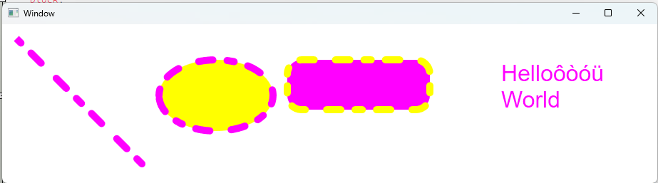
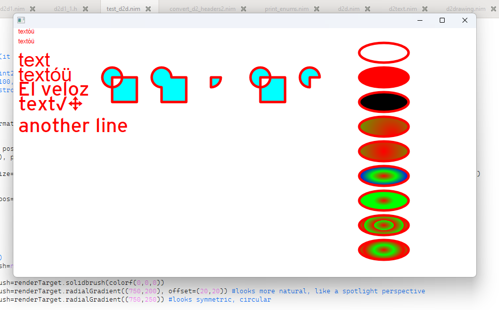
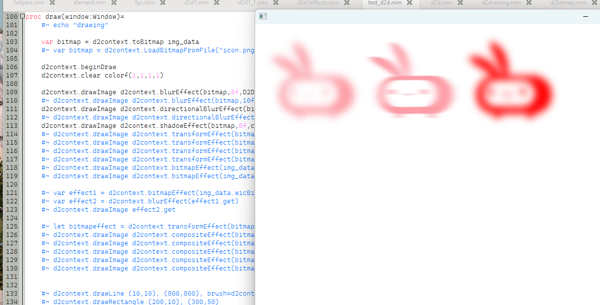
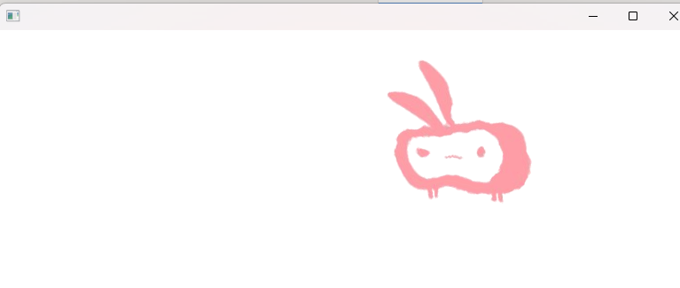
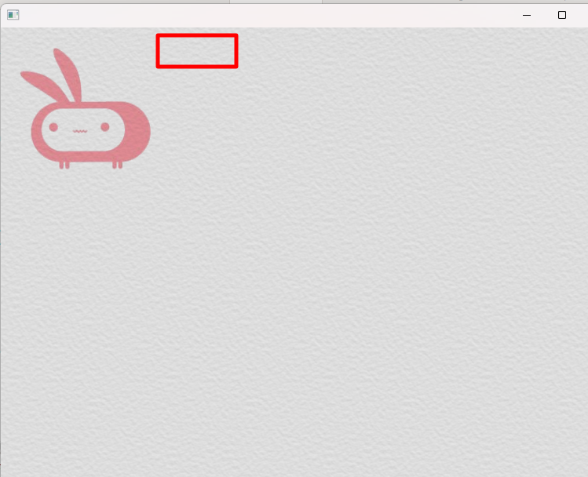
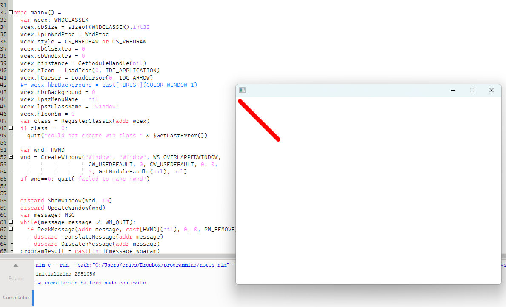
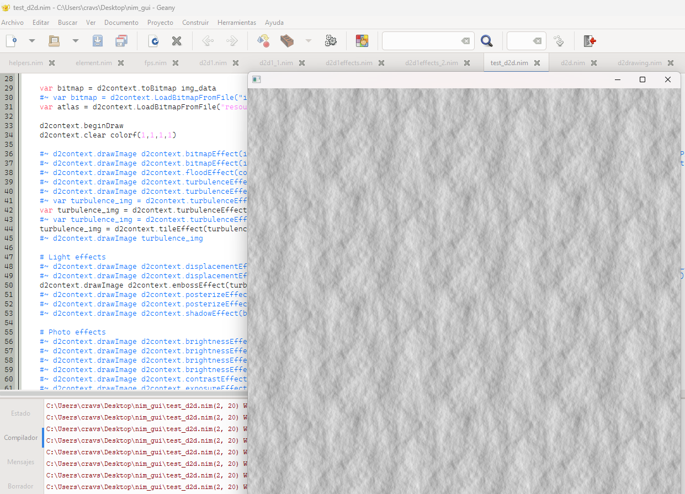

## direct
Nim bindings for Direct 2d C interface, dwrite, deffects, xaudio2, etc.

I have tested most of direct2d including effects so everything should be fine, I might add some examples later.

Examples:
<p align="center">








</p>


### Installation:
```nim
nimble install https://github.com/shujidev/direct
```

### Missing parts:
Currently functions have to be called like this example for compatibility with C
```nim
renderTarget.lpVtbl.BeginDraw(renderTarget)
```

Since there is no inheritance I think there have to be converters for the updated libraries which are derived from previously released classes.

Something like this for each file:
```nim
converter toFactory*(x:ptr ID2D1Factory1):ptr ID2D1Factory = cast[ptr ID2D1Factory](x)
converter toRenderTarget*(x:ptr ID2D1DeviceContext):ptr ID2D1RenderTarget = cast[ptr ID2D1RenderTarget](x)
converter toDXGIDevice*(x:ptr IDXGIDevice1):ptr IDXGIDevice = cast[ptr IDXGIDevice](x)
converter toDXGIDevice*(x:ptr IDXGIDevice2):ptr IDXGIDevice = cast[ptr IDXGIDevice](x)
```


### Create functions
In this example an object like smart pointer is used to free resources automatically, I suppose this could also be made with com pointers (smart pointers with com destructors) as mentioned here: https://learn.microsoft.com/en-us/windows/win32/xaudio2/how-to--play-a-sound-with-xaudio2, I am not sure if winim has that implementation

```nim
type RenderTarget* = object
    p:ptr ID2D1RenderTarget
proc `=destroy`*(x:var RenderTarget) = x.p.toResource.release
converter toPtr*(x:RenderTarget): ptr ID2D1RenderTarget = x.p


proc createRenderTarget*(factory:ptr ID2D1Factory, hwnd:HWND, hardware=true): RenderTarget =
    var rc: windef.RECT
    GetClientRect(hwnd, addr rc)
    var size = D2D1_SIZE_U(width: rc.right, height: rc.bottom)
    var props = D2D1_RENDER_TARGET_PROPERTIES(
                    #~ `type`: D2D1_RENDER_TARGET_TYPE_SOFTWARE,
                    #~ `type`: D2D1_RENDER_TARGET_TYPE_HARDWARE,
                    pixelFormat: D2D1_PIXEL_FORMAT(format:DXGI_FORMAT_B8G8R8A8_UNORM, alphaMode:D2D1_ALPHA_MODE_PREMULTIPLIED)) #alpha mode:UNKNOWN,PREMULTIPLIED,IGNORE
    if not hardware: props.`type`=D2D1_RENDER_TARGET_TYPE_SOFTWARE #TYPE_SOFTWARE is important if want to get a bitmap from rendertarget
    var hwnd_props = D2D1_HWND_RENDER_TARGET_PROPERTIES(hwnd:hwnd, pixelSize:size)
    var hr = factory.lpVtbl.CreateHwndRenderTarget(factory, addr props, addr hwnd_props, cast[ptr ptr ID2D1HwndRenderTarget](addr result.p))
    if hr!=S_OK: echo "CreateHwndRenderTarget error ",hr.toHex
 ```
